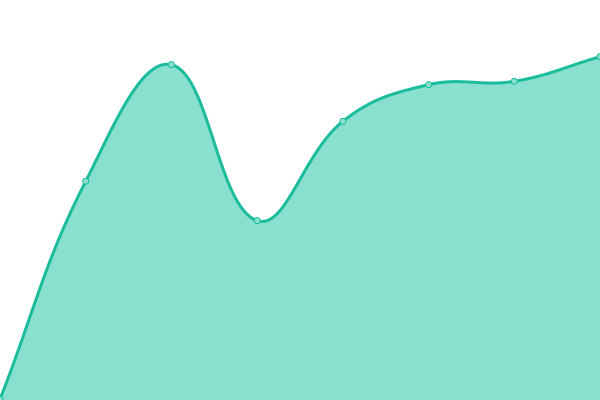
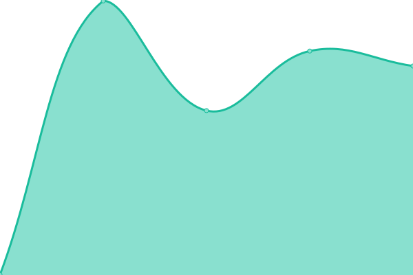
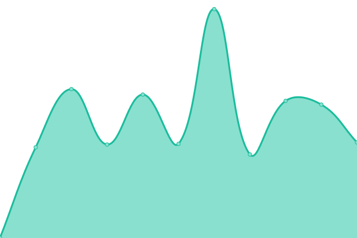
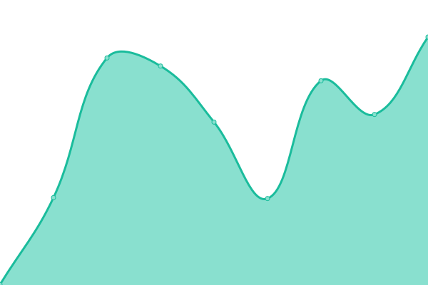
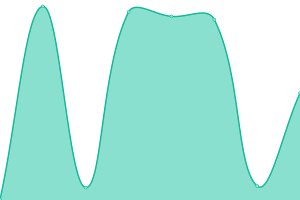
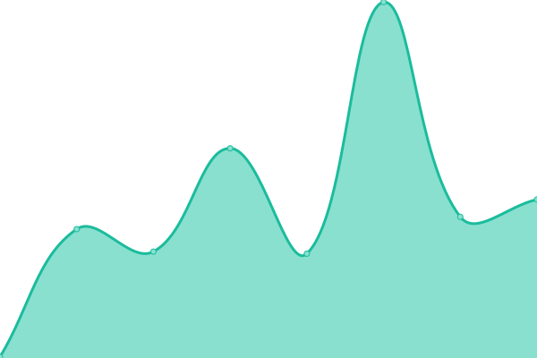
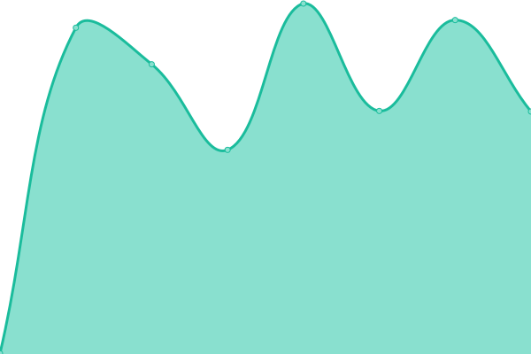
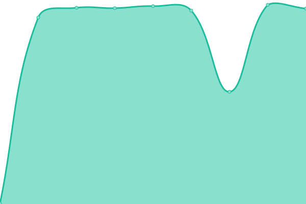
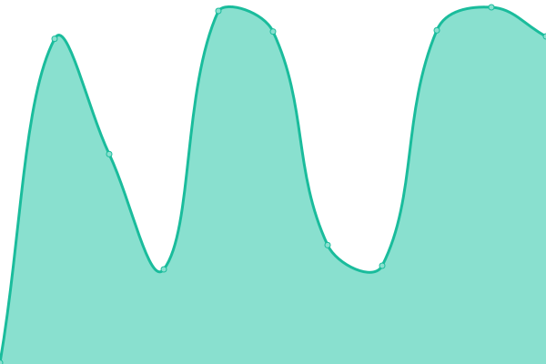

# [📈 Live Status](https://status.fortisase.com/): <!--live status--> **🟧 Partial outage**

This repository contains the open-source uptime monitor and status page for [auto-fortisase](https://auto-fortisase.github.io/uptime), powered by [Upptime](https://github.com/upptime/upptime).

With [Upptime](https://upptime.js.org), you can get your own unlimited and free uptime monitor and status page, powered entirely by a GitHub repository. We use [Issues](https://github.com/auto-fortisase/uptime/issues) as incident reports, [Actions](https://github.com/auto-fortisase/uptime/actions) as uptime monitors, and [Pages](https://auto-fortisase.github.io/uptime) for the status page.

<!--start: status pages-->
<!-- This summary is generated by Upptime (https://github.com/upptime/upptime) -->
<!-- Do not edit this manually, your changes will be overwritten -->
<!-- prettier-ignore -->
| URL | Status | History | Response Time | Uptime |
| --- | ------ | ------- | ------------- | ------ |
|  [FortiSASE SIA Cloud](https://portal.prod.fortisase.com/) | 🟩 Up | [forti-sase-sia-cloud.yml](https://github.com/auto-fortisase/upptime/commits/HEAD/history/forti-sase-sia-cloud.yml) | 

 220ms
     
 | 

<a href="https://status.fortisase.com/history/forti-sase-sia-cloud">100.00%</a>
    

|  [FortiSASE SIA Edge Canada West (Vancouver)](https://mgmt-fos001-region1.prod.fortisase.com:10443/) | 🟩 Up | [forti-sase-sia-edge-canada-west-vancouver.yml](https://github.com/auto-fortisase/upptime/commits/HEAD/history/forti-sase-sia-edge-canada-west-vancouver.yml) | 

 298ms
     
 | 

<a href="https://status.fortisase.com/history/forti-sase-sia-edge-canada-west-vancouver">100.00%</a>
    

|  [FortiSASE SIA Edge Canada East (Ottawa)](https://mgmt-fos001-region2.prod.fortisase.com:10443/) | 🟩 Up | [forti-sase-sia-edge-canada-east-ottawa.yml](https://github.com/auto-fortisase/upptime/commits/HEAD/history/forti-sase-sia-edge-canada-east-ottawa.yml) | 

 381ms
     
 | 

<a href="https://status.fortisase.com/history/forti-sase-sia-edge-canada-east-ottawa">100.00%</a>
    

|  [FortiSASE SIA Edge France (Valbonne)](https://mgmt-fos001-region3.prod.fortisase.com:10443/) | 🟩 Up | [forti-sase-sia-edge-france-valbonne.yml](https://github.com/auto-fortisase/upptime/commits/HEAD/history/forti-sase-sia-edge-france-valbonne.yml) | 

 900ms
     
 | 

<a href="https://status.fortisase.com/history/forti-sase-sia-edge-france-valbonne">100.00%</a>
    

|  [FortiSASE SIA Edge Japan (Tokyo)](https://mgmt-fos001-region4.prod.fortisase.com:10443/) | 🟩 Up | [forti-sase-sia-edge-japan-tokyo.yml](https://github.com/auto-fortisase/upptime/commits/HEAD/history/forti-sase-sia-edge-japan-tokyo.yml) | 

 837ms
     
 | 

<a href="https://status.fortisase.com/history/forti-sase-sia-edge-japan-tokyo">100.00%</a>
    

|  [FortiSASE SIA Edge Germany (Frankfurt)](https://mgmt-fos001-region5.prod.fortisase.com:10443/) | 🟩 Up | [forti-sase-sia-edge-germany-frankfurt.yml](https://github.com/auto-fortisase/upptime/commits/HEAD/history/forti-sase-sia-edge-germany-frankfurt.yml) | 

 854ms
     
 | 

<a href="https://status.fortisase.com/history/forti-sase-sia-edge-germany-frankfurt">100.00%</a>
    

|  [FortiSASE SIA Edge UK (London)](https://mgmt-fos001-region6.prod.fortisase.com:10443/) | 🟩 Up | [forti-sase-sia-edge-uk-london.yml](https://github.com/auto-fortisase/upptime/commits/HEAD/history/forti-sase-sia-edge-uk-london.yml) | 

 742ms
     
 | 

<a href="https://status.fortisase.com/history/forti-sase-sia-edge-uk-london">100.00%</a>
    

|  [FortiSASE SIA Edge US West (San Jose)](https://mgmt-fos001-region7.prod.fortisase.com:10443/) | 🟩 Up | [forti-sase-sia-edge-us-west-san-jose.yml](https://github.com/auto-fortisase/upptime/commits/HEAD/history/forti-sase-sia-edge-us-west-san-jose.yml) | 

 215ms
     
 | 

<a href="https://status.fortisase.com/history/forti-sase-sia-edge-us-west-san-jose">100.00%</a>
    

|  [FortiSASE SIA Edge US East (Ashburn)](https://mgmt-fos001-region8.prod.fortisase.com:10443/) | 🟩 Up | [forti-sase-sia-edge-us-east-ashburn.yml](https://github.com/auto-fortisase/upptime/commits/HEAD/history/forti-sase-sia-edge-us-east-ashburn.yml) | 

 313ms
     
 | 

<a href="https://status.fortisase.com/history/forti-sase-sia-edge-us-east-ashburn">100.00%</a>
    

|  [FortiStack API Canada West (Vancouver)](https://fortistackapi-nova-west.fortisase.com:5000/v3) | 🟥 Down | [forti-stack-api-canada-west-vancouver.yml](https://github.com/auto-fortisase/upptime/commits/HEAD/history/forti-stack-api-canada-west-vancouver.yml) | 

 176ms
     
 | 

<a href="https://status.fortisase.com/history/forti-stack-api-canada-west-vancouver">100.00%</a>
    

|  [FortiStack API Canada East (Ottawa)](https://fortistackapi-nova-east.fortisase.com:5000/v3) | 🟩 Up | [forti-stack-api-canada-east-ottawa.yml](https://github.com/auto-fortisase/upptime/commits/HEAD/history/forti-stack-api-canada-east-ottawa.yml) | 

 210ms
     
 | 

<a href="https://status.fortisase.com/history/forti-stack-api-canada-east-ottawa">100.00%</a>
    

|  [FortiStack API France (Valbonne)](https://fortistackapi-nova-fr.fortisase.com:5000/v3) | 🟩 Up | [forti-stack-api-france-valbonne.yml](https://github.com/auto-fortisase/upptime/commits/HEAD/history/forti-stack-api-france-valbonne.yml) | 

 632ms
     
 | 

<a href="https://status.fortisase.com/history/forti-stack-api-france-valbonne">100.00%</a>
    

|  [FortiStack API Japan (Tokyo)](https://fortistackapi-nova-jp.fortisase.com:5000/v3) | 🟩 Up | [forti-stack-api-japan-tokyo.yml](https://github.com/auto-fortisase/upptime/commits/HEAD/history/forti-stack-api-japan-tokyo.yml) | 

 440ms
     
 | 

<a href="https://status.fortisase.com/history/forti-stack-api-japan-tokyo">100.00%</a>
    

|  [FortiStack API Germany (Frankfurt)](https://fortistackapi-de-fr7.fortisase.com:5000/v3) | 🟩 Up | [forti-stack-api-germany-frankfurt.yml](https://github.com/auto-fortisase/upptime/commits/HEAD/history/forti-stack-api-germany-frankfurt.yml) | 

 468ms
     
 | 

<a href="https://status.fortisase.com/history/forti-stack-api-germany-frankfurt">100.00%</a>
    

|  [FortiStack API UK (London)](https://fortistackapi-uk-ld9.fortisase.com:5000/v3) | 🟩 Up | [forti-stack-api-uk-london.yml](https://github.com/auto-fortisase/upptime/commits/HEAD/history/forti-stack-api-uk-london.yml) | 

 413ms
     
 | 

<a href="https://status.fortisase.com/history/forti-stack-api-uk-london">100.00%</a>
    

|  [FortiStack API US West (San Jose)](https://fortistackapi-us-sv10.fortisase.com:5000/v3) | 🟩 Up | [forti-stack-api-us-west-san-jose.yml](https://github.com/auto-fortisase/upptime/commits/HEAD/history/forti-stack-api-us-west-san-jose.yml) | 

 148ms
     
 | 

<a href="https://status.fortisase.com/history/forti-stack-api-us-west-san-jose">100.00%</a>
    

|  [FortiStack API US East (Ashburn)](https://fortistackapi-us-dc11.fortisase.com:5000/v3) | 🟩 Up | [forti-stack-api-us-east-ashburn.yml](https://github.com/auto-fortisase/upptime/commits/HEAD/history/forti-stack-api-us-east-ashburn.yml) | 

 193ms
     
 | 

<a href="https://status.fortisase.com/history/forti-stack-api-us-east-ashburn">100.00%</a>
    

<!--end: status pages-->

[**Visit our status website →**](https://auto-fortisase.github.io/uptime)

## 📄 License

- Powered by: [Upptime](https://github.com/upptime/upptime)
- Code: [MIT](./LICENSE) © [auto-fortisase](https://auto-fortisase.github.io/uptime)
- Data in the `./history` directory: [Open Database License](https://opendatacommons.org/licenses/odbl/1-0/)
